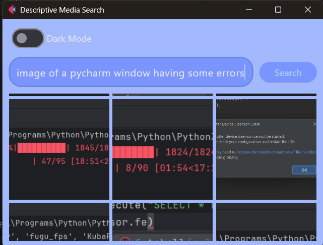
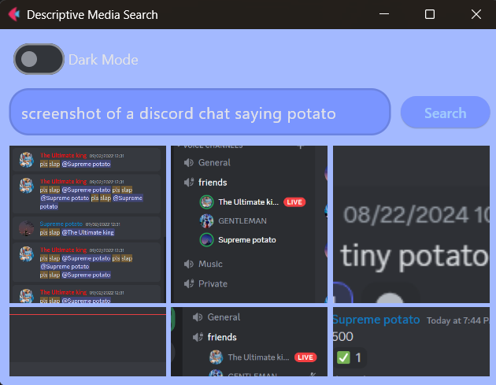

# Descriptive-Image-Search

Search your local images using natural language descriptions.  
Built using OpenAI's CLIP model.

---

## Setup

1. Clone the repository:
   ```bash
   git clone https://github.com/yourusername/Descriptive-Image-Search
   cd Descriptive-Image-Search
   ```

2. Install dependencies:
   ```bash
   pip install -r requirements.txt
   ```

3. Run the app:
   ```bash
   python main.py
   ```

4. On first run, the app will download the required CLIP model from the internet.

> **Note:** If the model download fails, try:
> - Running the script as Administrator (on Windows)
> - Enabling Developer Mode (`Settings > Privacy & security > For developers`)

---

## How to Use

1. When the app launches, choose the folder that contains your images.
2. Click **Start** to begin generating image embeddings.
3. A progress bar will appear (⚠ currently, elapsed and remaining time are broken).
4. Once embedding is complete, the app will take you to the search interface.
5. Type a description and click **Search**.
6. Click on any image to open it.

> Embeddings are saved and reused. You only need to regenerate them if new images are added.  
> Auto-detecting changes and updating embeddings is a planned feature.

---

## Features

- Search images by describing them (e.g., "a group of friends at a beach")
- Uses CLIP to match descriptions to image content
- Simple GUI
- Click on images to open them
- Reuses saved embeddings to avoid reprocessing

---

## Planned Improvements

- Automatically detect and update embeddings when images change
- Show elapsed and remaining time during embedding

---

## Screenshots






---

## Files

- `app.py` – GUI elements
- `functions.py` – Helper functions
- `main.py` – App logic and entry point
- `assets` - Contains image files for the readme

---

## **Contact**  
For any questions or further information, feel free to reach out at **basilbenny1002@gmail.com**.  


